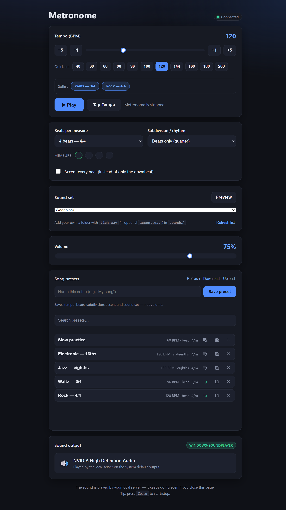

# metronom

A zero-dependency Node.js metronome. The server generates click sounds (WAV) and
schedules beats in real time — and **plays them itself** on the machine's
default audio output. The browser is only a control panel and visualizer; the
sound keeps going even if you close it (or never open one at all — you can drive
everything from the terminal).

No build step, no native modules, no npm dependencies — just Node ≥ 22.

## Screenshot

<p align="center">
  
</p>

## License and Disclaimer

This project is licensed for **free non-commercial use** (see the
[`LICENSE`](./LICENSE) file). You may use, copy, modify, and redistribute it for
personal, educational, research, or hobby purposes. **Commercial use is not
permitted** without prior, explicit written consent from the copyright holder
— if you want to use it commercially, please reach out at
[github.com/AGoliath](https://github.com/AGoliath) to arrange it.

Please note: This is a trial project to test the new qwen3.8:27b model, run via Ollama on an RTX 5090.
It was written entirely by agentic coding — not a single line was edited by hand on purpose. Even the smallest change was made by the AI, even where a manual edit would have been faster. I have reviewed the code and understand it, so it should be fine and safe, but I give no guarantee whatsoever.

## Quick start

```bash
npm start          # starts the server at http://localhost:3000
```

Then open <http://localhost:3000> in a browser.

You can also drive it from the terminal (useful for scripting or remote control):

```bash
node cli.js start            # begin playing
node cli.js bpm 96           # set tempo
node cli.js beats 3          # 3 beats per measure
node cli.js sub 2            # subdivide into eighths
node cli.js accent on        # accent every beat (off = downbeat only)
node cli.js volume 0.6       # 0..1
node cli.js status           # show current config
node cli.js device           # which output device is it playing on?
node cli.js stop             # stop
```

> **Heads up:** the sound is produced by the *server process*, so the metronome
> only makes noise while `node server.js` (or `npm start`) is running. Closing
> the browser, or driving it purely from the CLI, changes nothing about the audio.

Set a different port or server URL with environment variables:

```bash
PORT=8080 npm start
METRONOME_URL=http://192.168.1.10:3000 node cli.js status
```

## Features

- **Tempo** — 40–300 BPM, with fine (±1) and coarse (±5) nudge buttons, plus **tap tempo**.
- **Rhythm** — 1–16 beats per measure (the "top number" of the time signature).
- **Subdivision** — beat, eighths, triplets, or sixteenths.
- **Accent** — accent the downbeat only, or every beat.
- **Volume** — 0–1.
- **Song presets** — save & reload your setup (tempo, beats, subdivision,
  accent, sound set) under a name; volume is not stored. See [Song presets](#song-presets).
- **Space bar** toggles play/pause in the web UI.
- Live beat-dot preview that pulses on each beat and flashes accents.
- **Server-side playback** — sound is rendered and played by the Node server on
  the system default output, so it works without any browser open.
- **Output device display** — the web UI shows which device the server is
  playing on, plus the playback backend status.
- **Custom sound sets** — pick a set of click sounds (tick + accent) from the
  UI, CLI, or by dropping WAV files into `sounds/`. See [Sound sets](#sound-sets).

## Sound sets

By default the metronome uses a **built-in** click that is synthesized in
JavaScript (no files needed). You can also use your **own** sounds:

1. Create a folder in `sounds/`, e.g. `sounds/woodblock/`.
2. Put a `tick.wav` (the regular beat) and, optionally, an `accent.wav`
   (the downbeat) inside it. If there's no `accent.wav`, the downbeat reuses
   `tick.wav`.
3. Pick the set in the web UI ("Sound set" dropdown, with a **Preview** button),
   or from the CLI:

   ```bash
   node cli.js sounds          # list available sets
   node cli.js set woodblock   # choose one
   node cli.js preview woodblock  # play a one-off tick + accent
   ```

A bundled `woodblock` set ships with the project. The full rules for your own
files (length, levels, naming) are in [`sounds/README.md`](./sounds/README.md).

## Song presets

Save your whole setup — **tempo, beats per measure, subdivision, accent and
sound set** — under a custom name and reload it in one click. **Volume is
deliberately not saved**, so applying a preset never changes the level you've
dialed in.

- **Web UI** — the "Song presets" panel has a name box and a **Save preset**
  button. Saved presets list below, each showing its tempo and subdivision
  (e.g. `132 BPM · eighths · 3/measure`) next to the name; click a name to
  apply it, the 💾 to overwrite it with the current settings (with a confirm),
  and the ✕ to delete it (with a confirm).
- **Setlist** — tap the playlist icon on a preset to add it to your **setlist**; it
  is then pinned to a
  **Setlist** row that appears just below the quick-set BPM buttons; click a
  setlist entry to load it instantly. Great for building a gig's running order.
  The row hides itself when the setlist is empty.
- **Download / Upload** — the panel header has a **Download** button (saves all
  presets to a `metronome-presets.json` file, identical in shape to
  `presets.json`) and an **Upload** button (pick a JSON file to *replace the
  entire preset list*). Upload accepts either a raw JSON array of presets or an
  object of the form `{ "presets": [...] }`.
- **CLI**:

  ```bash
  node cli.js presets            # list saved presets
  node cli.js apply "My Ballad"  # load a preset (tempo/beats/subdivision/accent/sound)
  ```

Presets are stored by the backend in **`presets.json`** in the project root
(plain JSON, created on first save). Saving with a name that already exists
**overwrites** it.

> Note: file-based sets play at the recorded level — the UI's **Volume** slider
> only affects the *built-in* synthesized click (a `SoundPlayer` limitation).

## Architecture

```
                      ┌────────────────────────────┐
   beat scheduler ───►│  AudioPlayer (player.js)   │──► "play <file.wav>"
   (lookahead model)  └─────────────┬──────────────┘   "b64 <wav-bytes>"
                                    │ spawns stdin/stdout   │
                                    ▼                        ▼
                              ┌─────────────────────────────────────┐
                              │  play_worker.ps1 (long-lived)       │
                              │  plays the file (or decoded WAV) via│
                              │  System.Media.SoundPlayer on the    │
                              │  system DEFAULT output device       │
                              └─────────────────────────────────────┘

   sounds/<set>/tick.wav + accent.wav  ──►  picked per the active sound set
   (sounds.js)

   Browser (public/) ──► GET /api/audio   ──►  shows device name + backend
                     └─► GET /api/sounds  ──►  list of available sound sets
                     └─► EventSource (SSE) ─►  beat-dot visualizer only
   CLI (cli.js) ─────►  REST config/start/stop/status/device/sounds/set/preview
```

- **Server** (`server.js`, `node:http`, no framework)
  - **Beat scheduler** — a lookahead model that pre-computes beats inside a
    small window (`25 ms`) and emits each one as it's due. Runs on an `8 ms`
    interval. Timing stays tight because *when* is computed server-side and the
    sound is scheduled at that exact moment.
  - **Audio** (`audio.js`) — the *built-in* fallback click (a sine burst with a
    linear attack + exponential-decay envelope), plus WAV encode/decode and the
    gain tools (`normalizeSamples`, `scaleSamples`). No native dependencies, so
    it works on any Node version.
  - **Sound sets** (`sounds.js`) — discovers sets from the `sounds/` folder
    (each folder = one set with `tick.wav` + optional `accent.wav`), resolves a
    set id to its audio, and **peak-normalizes** each set on load (tick → 0.62,
    accent → 1.0) so every set plays at a consistent level with the downbeat
    reading clearly louder. The `builtin` set is always available.
  - **Playback** (`player.js` + `play_worker.ps1`) — an `AudioPlayer` owns a
    long-lived PowerShell worker and hands it each rendered click as WAV bytes
    (`b64 <…>`). The worker writes them to a short-lived temp file and plays it
    on the default output. If the worker ever dies it is transparently
    respawned; if no audio backend is available at all, playback silently becomes
    a no-op and the rest of the server keeps working.
  - **Device discovery** (`device.js` + `get_device_name.ps1`) — resolves the
    default render device name, trying (in order) the Core Audio COM API, WMI
    `Win32_SoundDevice`, then the `MMDevices` registry, and finally a generic
    “System default output” fallback. The result is cached.
  - **SSE stream** (`GET /api/stream`) — a status/visualization feed (no audio).
- **Browser** (`public/`) — a pure control panel: starts/stops, edits config,
  picks a sound set (with a one-click preview), shows the live beat dots, and
  displays the output device + backend. It does **not** play any audio.
- **CLI** (`cli.js`) — full remote control over the REST API, including
  `device`, `sounds`, `set`, and `preview` commands.

## Configuration model

| Field             | Range | Default | Description                                  |
| ----------------- | ----- | ------- | -------------------------------------------- |
| `running`         | bool  | `false` | Whether the metronome is currently playing.  |
| `bpm`             | 40–300| `120`   | Tempo.                                       |
| `beatsPerMeasure` | 1–16  | `4`     | Beats per measure.                           |
| `subdivision`     | 1/2/3/4| `1`   | 1=beat, 2=eighths, 3=triplets, 4=sixteenths.|
| `accentEveryBeat` | bool  | `false` | Accent every beat vs. downbeat only.         |
| `volume`          | 0–1   | `0.75`  | Volume (applies to the built-in synthesized click). |
| `soundSet`        | string| `builtin` | Active sound set id (a folder in `sounds/`, or `builtin`). |

## HTTP API

| Method | Path            | Description                                            |
| ------ | --------------- | ------------------------------------------------------ |
| GET    | `/api/health`   | `{ ok, running, config }` — liveness + state.          |
| GET    | `/api/config`   | Current config.                                         |
| POST   | `/api/config`   | Update config (partial object). Returns new config.     |
| POST   | `/api/start`    | Start the metronome.                                    |
| POST   | `/api/stop`     | Stop the metronome.                                     |
| GET    | `/api/audio`    | `{ backend, workerAlive, deviceName }` — which output the server uses. |
| GET    | `/api/click`    | A rendered click WAV. `?level=tick\|accent&volume=0.75`.|
| GET    | `/api/sounds`   | `{ active, sets: [...] }` — the available sound sets.   |
| POST   | `/api/preview`  | Play a one-shot tick + accent of a set. Body: `{ soundSet }`. |
| GET    | `/api/presets`  | `{ presets: [...] }` — saved song presets (newest first).      |
| POST   | `/api/presets`  | Save a named preset. Body: `{ name, bpm, beatsPerMeasure, subdivision, accentEveryBeat, soundSet }`. |
| GET    | `/api/presets/export` | Download all presets as a `metronome-presets.json` attachment. |
| POST   | `/api/presets/import` | Replace all presets from a JSON body (array or `{ presets: [...] }`). |
| DELETE | `/api/presets/:name` | Delete a preset by name (URL-encoded).                      |
| GET    | `/api/stream`   | SSE stream of scheduled click events (visualization only).|
| GET    | `/*`            | Static files from `public/`.                            |

**`/api/audio`** example:

```json
{ "backend": "windows/soundplayer", "workerAlive": true, "deviceName": "NVIDIA High Definition Audio" }
```

**SSE click event** (payload of a `data:` line) — used to drive the beat-dot
visualizer; the audio itself is played by the server, not the browser:

```json
{ "type": "click", "when": 1736700000000, "level": "accent", "beat": 0, "inMeasure": 1 }
```

## Project layout

```
.
├── audio.js              # Click synthesis + WAV encode/decode + normalization
├── presets.js            # Named song presets (list/save/delete) → presets.json
├── presets.json          # Saved song presets (auto-created on first save)
├── sounds.js             # Discovers/resolves sound sets from sounds/
├── server.js             # HTTP server: config API, beat scheduler, playback, SSE
├── player.js             # AudioPlayer: owns the PowerShell playback worker
├── play_worker.ps1       # Windows worker: plays base64 WAV lines (SoundPlayer)
├── device.js             # Resolves the default output device name (cached)
├── get_device_name.ps1   # Windows helper: layered device-name discovery
├── make_soundset.mjs     # Generates a demo WAV sound set
├── cli.js                # Terminal control over the HTTP API
├── sounds/               # Sound sets (folders of .wav), see sounds/README.md
│   └── woodblock/
│       ├── tick.wav
│       └── accent.wav
├── public/
│   ├── index.html        # Web UI (control panel + sound set picker + device display)
│   ├── app.js            # SSE client, controls, sound set picker (no audio)
│   └── styles.css        # Dark theme
└── package.json          # type: module, start + cli + sounds scripts
```

## Notes

- Audio is rendered **and** played on the **server**, on the machine's default
  output device. The browser plays nothing — it only controls and visualizes.
  So the metronome keeps sounding as long as the server is running, even with
  no browser open.
- **Playback backend** is Windows-specific (PowerShell +
  `System.Media.SoundPlayer`). On other OSes the worker is not used; the server
  still runs and all HTTP endpoints work, but `play()` is a no-op and
  `/api/audio` reports `backend: "unavailable"`.
- **Sound-set volume**: each imported set is **peak-normalized** on load (tick
  → 0.62, accent → 1.0) so every set plays at a consistent level and the
  downbeat always reads clearly louder than the beat, regardless of how the
  files were cut. The UI/CLI **Volume slider works for every set** — it scales
  the normalized samples before playback (the built-in click is scaled the same
  way).
- **Clean playback**: every click gets a short fade-in/out so it can't pop at
  either edge, and the worker writes each click to a small *rotating pool* of
  temp files instead of deleting the file while `SoundPlayer` may still be
  reading it — this removes the brief noise/glitch that could follow a beat.
- **Device name** is resolved with graceful degradation (Core Audio COM API →
  WMI → registry → “System default output”). In some locked-down/sandboxed
  environments the name may fall back to the generic label — the metronome
  itself is unaffected.
- The server keeps a single in-memory config; restart it to reset to defaults.
